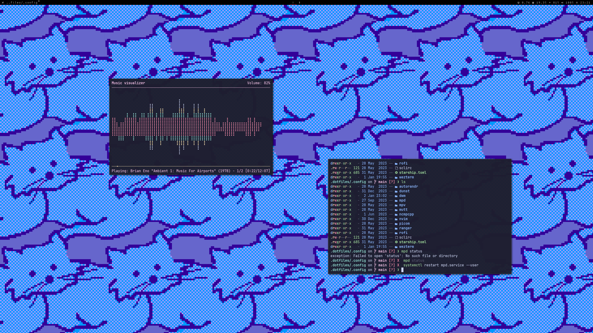
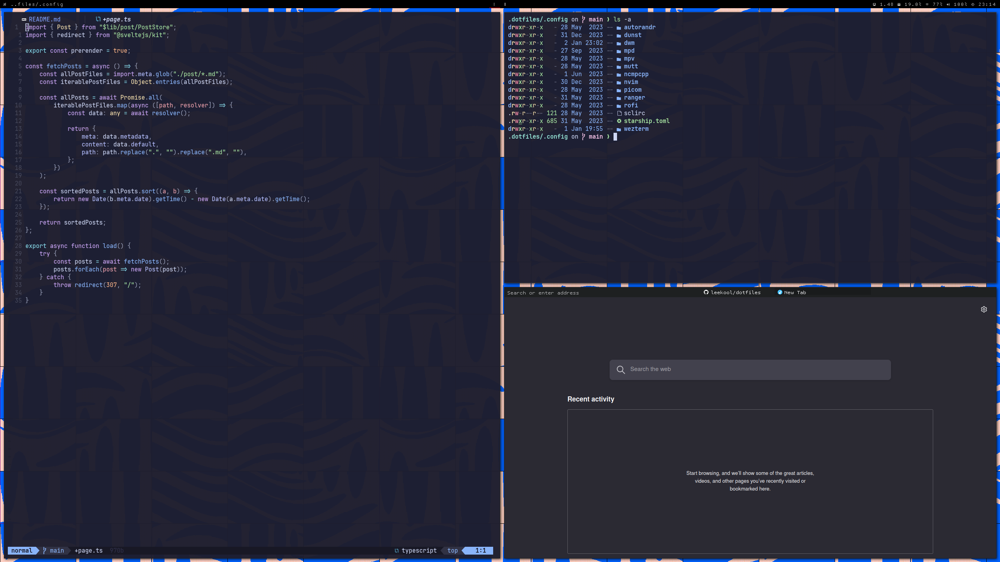

## dotfiles

#### screenshots

#### details
- shell: [zsh](https://www.zsh.org)
- terminal: [wezterm](https://wezfurlong.org/wezterm/index.html)
- window manager: [dwm](https://dwm.suckless.org/)
- compositor: [picom](https://github.com/yshui/picom)
- editor: [neovim](https://github.com/neovim/neovim)
- music: [ncmpcpp](https://github.com/ncmpcpp/ncmpcpp)
- file browser: [ranger](https://github.com/ranger/ranger)
- notifications: [dunst](https://dunst-project.org)
- email: [mutt](http://mutt.org)
- key remapping: [kmonad](https://github.com/kmonad/kmonad)
- fonts:
    - [JetBrains Mono](https://www.jetbrains.com/lp/mono) with [Nerd Fonts](https://github.com/ryanoasis/nerd-fonts) fallback
    - [Cozette](https://github.com/slavfox/Cozette)
    - [Tamzen](https://github.com/sunaku/tamzen-font)

#### todo
- move from oh-my-zsh
- clickable dwm-blocks
- look into lazygit
- move librewolf css into repo
